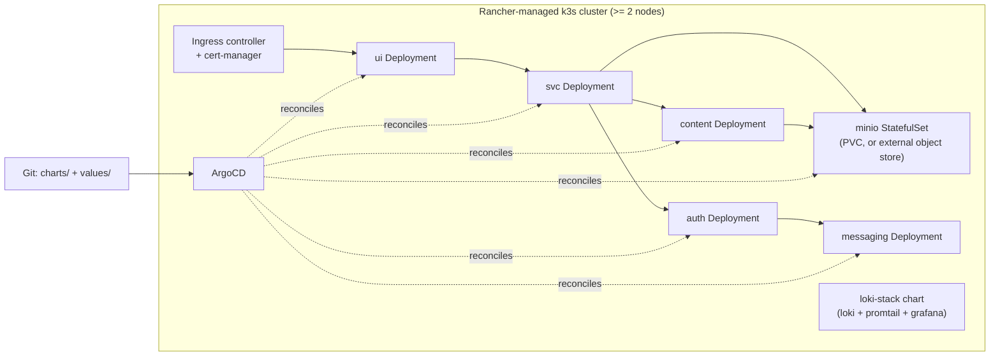

# Kubernetes / Rancher + ArgoCD Investigation

Status: exploratory spike (issue #91). Not a proposal, not scheduled work. This
document exists to answer "is this worth doing" once, explicitly, so the
question doesn't get re-litigated informally every few months.

**Verdict: not doing this now.** See [Trigger conditions](#trigger-conditions)
for what would change that.

## Current design (Docker Compose, single node)

Everything runs as one Docker Compose project (`-p quillit`) on a single home
server (`pop-os`), deployed via an ephemeral per-run checkout from GitHub
Actions (`.github/workflows/app-pipeline.yml` et al.) — no persistent clone,
no cluster, no scheduler beyond `restart: unless-stopped`.

```mermaid
flowchart LR
    subgraph "pop-os (single node)"
        Caddy["caddy\n(TLS, overlay)"] --> UI["ui\n:8080"]
        UI --> SVC["svc\n:3000"]
        SVC --> AUTH["auth\n:3002"]
        SVC --> CONTENT["content\n:3004"]
        SVC --> MINIO["minio\n:9000/9001"]
        CONTENT --> MINIO
        AUTH --> MESSAGING["messaging\n:3003"]

        PROMTAIL["promtail\n(overlay)"] -.reads docker.sock.-> Caddy
        PROMTAIL -.-> UI
        PROMTAIL -.-> SVC
        PROMTAIL -.-> AUTH
        PROMTAIL -.-> CONTENT
        PROMTAIL -.-> MESSAGING
        PROMTAIL --> LOKI["loki\n(overlay)"]
        LOKI --> GRAFANA["grafana\n:3001, overlay"]
    end
```

Core services (`infra/docker-compose.yml`): `auth`, `messaging`, `svc`,
`content`, `minio`, `ui`. Two optional overlays layer on top:
`docker-compose.caddy.yml` (Caddy/TLS ingress) and
`docker-compose.logging.yml` (Loki + Promtail + Grafana).

State lives in local named volumes tied to this one host: `auth-data`,
`content-data`, `svc-data`, `minio-data`, plus `caddy-data`, `caddy-config`,
`loki-data`, `grafana-data` from the overlays. No distributed storage, no
replication — the volumes *are* the durability story.

Deploys are per-category, per-service, `docker compose up -d --no-deps
<service>` triggered independently by `app-pipeline.yml`,
`infra-pipeline.yml`, and `observability-pipeline.yml`. The Compose project
name is pinned explicitly everywhere to avoid a fresh ephemeral checkout
directory accidentally creating a second, orphaned project.

### What this gives you for free vs. what it can't do

| Today's model gives you | Today's model can't do |
|---|---|
| Zero control-plane to run, patch, or secure | Horizontal scaling of any service |
| Deploys in minutes, no cluster bootstrap | Rolling, replica-by-replica zero-downtime deploys (restarts are per-container, not per-replica) |
| One host to reason about — logs, disk, backups all in one place | Surviving hardware failure of `pop-os` — there is no failover target |
| `--no-deps` restarts are simple and fast for this service count | Declarative drift detection / GitOps reconciliation (deploys are imperative CI steps, not a reconciled desired state) |
| Named volumes are trivially backed up (`operations/backup.sh`) | Multi-node scheduling, bin-packing, or resource quotas |

## Target design (hypothetical: k3s/Rancher + ArgoCD)

Sketched at the same granularity as the current design, service-for-service,
so the two are directly comparable. Nothing below is implemented, and no
Helm charts, Kubernetes manifests, or ArgoCD Application resources exist in
this repo as a result of writing this doc.



### Service → chart mapping

| Compose service | k8s equivalent | Notes |
|---|---|---|
| `auth`, `messaging`, `svc`, `content`, `ui` | Deployment + Service, one Helm (sub)chart each | Stateless app processes; horizontal scaling actually means something here |
| `minio` | StatefulSet + PVC, or replace with a managed/external object store | Only workload with real state; single-node k8s gives it nothing a Compose volume doesn't already have |
| `caddy` overlay | Ingress controller (e.g. Traefik/nginx) + cert-manager | TLS termination moves from a hand-rolled Caddyfile to a controller + Issuer resources |
| `loki`/`promtail`/`grafana` overlay | `grafana/loki-stack` (or similar) community chart, values-only | Likely not worth a custom chart — wrap upstream |
| 3 GitHub Actions deploy jobs (app/infra/observability) | 3 ArgoCD Applications, one per category, each synced from a `charts/<category>` path | Mirrors the existing category split; GitOps pull-based sync replaces push-based CI deploy steps |

### What changes structurally

- `environment:` blocks → ConfigMaps (non-secret) + Secrets (JWT_SECRET,
  MINIO credentials, SMTP credentials, etc.), no longer plain `.env` files on
  the host.
- `depends_on:` (start-order only, no health awareness) → readiness/liveness
  probes, so `svc` genuinely waits for `auth`/`minio` to be ready rather than
  just started.
- `restart: unless-stopped` → Deployment `replicas` + `RollingUpdate`
  strategy; a crash becomes a rescheduled Pod instead of a restarted
  container on the same host.
- Imperative `docker compose up -d --no-deps` CI steps → declarative Git
  state, reconciled by ArgoCD; "deploy" becomes "merge to main and let the
  controller catch up" instead of a CI job doing the `compose up` itself.
- Single Caddyfile → Ingress resource(s) + cert-manager `Issuer`/`Certificate`
  objects; still one Caddyfile-equivalent to write, just split into k8s
  primitives.

### Where this sketch breaks down

The honest gap: everything above assumes a cluster with more than one node.
On the *current* single-node reality, a k3s control plane adds real
operational weight (etcd or SQLite datastore to babysit, another set of
credentials and RBAC to manage, a Rancher UI to keep patched) in exchange for
scheduling primitives that don't do anything useful with only one node to
schedule onto. StatefulSets and PVCs on a single node are not meaningfully
different from the named volumes we already have — the durability story
doesn't improve until there's a second node and a storage class that can
replicate across it.

## Trigger conditions

This is deliberately not a roadmap item. Revisit this investigation — not
necessarily commit to it — if any of the following becomes true:

1. **A second node is added** (physical or VM). Scheduling only starts
   earning its keep once there's more than one place to schedule onto.
2. **Zero-downtime rolling deploys become a real requirement**, beyond what
   `--no-deps` per-service restarts give today. Today's brief restart-per-
   deploy window has not been a reported problem.
3. **Horizontal scaling of a specific service becomes necessary** — e.g.
   `svc` or `content` CPU/throughput-bound under load in a way a bigger single
   box can't absorb.
4. **The operational burden of running a control plane is justified by
   service count or blast-radius** — e.g. enough services that per-service
   imperative CI deploys become the bottleneck rather than the simplicity win
   they are today.

None of these are true as of this writing. The single-node Compose model,
plus the ephemeral-checkout CI deploy pipeline from #86/#87, is intentionally
kept as the baseline until one of the above changes.

## Out of scope

- No changes to `infra/*.yml`, any `Dockerfile`, or `.github/workflows/*` as
  part of this investigation.
- Does not block cleanup work or any web-refactor milestone.
- No Helm charts or ArgoCD manifests were written; the tables/diagrams above
  are the entirety of the "target architecture" artifact for this spike.
